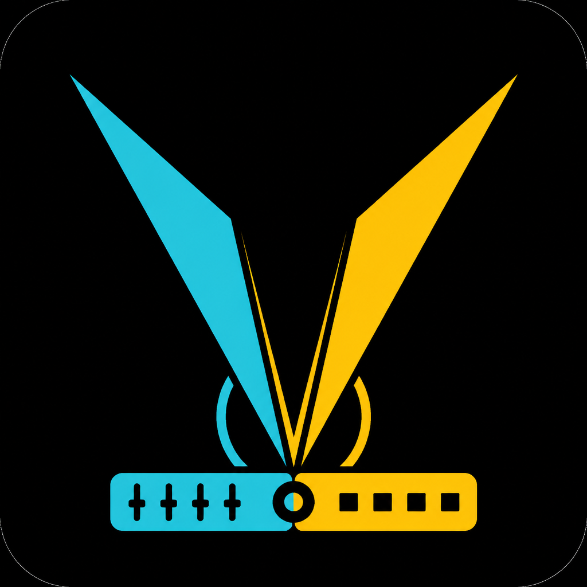

<p align="center">
  
</p>

<h1 align="center">OpenLightController</h1>

<p align="center">
  <strong>Cross-platform lighting console</strong> for live shows — fixtures, cues, playbacks,<br />
  Art-Net / sACN output, WebRemote, multi-monitor layouts, and Stream Deck control.
</p>

<p align="center">
  <a href="#features">Features</a> ·
  <a href="#quick-start">Quick start</a> ·
  <a href="#patch--fixture-library">Patch</a> ·
  <a href="#screen-layouts">Screens</a> ·
  <a href="#webremote">WebRemote</a> ·
  <a href="#stream-deck">Stream Deck</a> ·
  <a href="#build">Build</a>
</p>

---

OpenLightController is a free, open lighting controller inspired by compact onPC-style workflows.  
It runs natively on **Windows**, **macOS**, and **Linux** via [Tauri 2](https://v2.tauri.app/) (Rust engine + React UI).

> Repository: [github.com/TheMFCraft/OpenLightController](https://github.com/TheMFCraft/OpenLightController)

## Features

| Area | What you get |
|------|----------------|
| **Patch** | Fixture library by manufacturer, channel modes, Quantity & Offset |
| **Programmer** | Live attributes, HSV color wheel, groups & presets |
| **Cues** | Tracking cue lists with fade times |
| **Playbacks** | 8 faders, HTP dimmer / LTP other, programmer priority |
| **Network** | Art-Net + sACN (E1.31), 4 universes, configurable Art-Net target IP |
| **Screen layouts** | Unlimited external windows — each monitor gets its own panel (Playbacks, Cues, DMX Output, Status) |
| **WebRemote** | Browser control over LAN (playbacks, cues, blackout, output) |
| **Touch UI** | Optional touch mode + on-screen keyboard for text fields |
| **Stream Deck** | Auto-connects Elgato Stream Deck, assign actions / icons / labels to keys |
| **Showfile** | Save / load JSON shows, auto-save, editable show name |

### Fixture library (excerpt)

- **Laserworld** — EL-230RGB (12ch), EL / CS / DS / PL / tarm / Clubmax / CUBE (DJ + Professional modes)
- **Fun Generation** — Laser Derby, Mini Laser, PicoSpot 20/45, LED Pot, UV, Strobe
- **Stairville** — DJLase, Flood TRI Panel, LED PAR, MH movers, fog, LED bars
- **Generic** — Dimmer packs, RGB(W/A/UV), COB, bars/pixels, strobes, movers (spot/wash/beam), lasers, atmos
- Also: Chauvet, Martin-style profiles

## Quick start

### Requirements

- [Node.js](https://nodejs.org/) 20+
- [Rust](https://rustup.rs/) (stable)
- Platform deps for Tauri: [prerequisites](https://v2.tauri.app/start/prerequisites/)

### Develop

```bash
git clone https://github.com/TheMFCraft/OpenLightController.git
cd OpenLightController/apps/desktop
npm install
npm run tauri dev
```

From the repo root you can also use:

```bash
npm run dev
```

## Patch

1. Open **Patch**
2. Filter by **manufacturer**
3. Select a fixture → choose **channel mode**
4. Set **Universe**, **Address**, **Quantity**, **Offset** (address step; default = channel count)
5. Patch

Example **LED Wash** footprint (7ch): Dimmer · Shutter · R · G · B · W · *(ch7 unbound)*

## Screen layouts

Open **Settings → Screen Layouts** to create **unlimited external windows** — similar to dot2 onPC / grandMA screen layouts.

Each screen has:

- A **name** and **panel type**
- An optional **monitor** assignment (multi-monitor setups)
- Optional **fullscreen** on that monitor

| Panel | Purpose |
|-------|---------|
| **Playbacks** | 8 playback faders with GO / Back |
| **Cues** | Fire cues from all cue lists |
| **DMX Output** | Live view of all 512 channels (0–255) per universe |
| **Status & Master** | Large clock, blackout, and output toggles (touch-friendly) |

Example setup:

- Monitor 2 → DMX Output  
- Monitor 3 → Cues  
- Monitor 4 → Playbacks  
- Monitor 5 → Status & Master  

Screen definitions are saved locally. To change a panel, close the window, edit the screen, and open it again.

## WebRemote

1. Open **Settings → WebRemote**
2. Set a port (default **8080**) and click **Start WebRemote**
3. Open the shown URL on any phone / tablet / laptop on the same LAN

WebRemote supports playbacks, cue fire, blackout, output toggle, and clear programmer — with live state polling.

## Touch mode

Under **Settings → Touch & Keyboard**:

- **Touch mode** — larger buttons and touch-friendly input targets
- **On-screen keyboard** — virtual keyboard for text fields when touch mode is on

## Stream Deck

1. Quit the official Elgato Stream Deck software (it locks HID access)
2. Plug in the deck — OpenLightController **auto-connects** (and reconnects if unplugged)
3. Open **Stream Deck** → pick a key → set **action**, **label**, **icon**, and **color**
4. Hardware keys show icon + label; presses fire the assigned action

> Manual **Disconnect** turns auto-connect off until you connect again. Mappings are remembered locally.

On Linux you may need HID udev rules (see the [`elgato-streamdeck`](https://crates.io/crates/elgato-streamdeck) docs).

## Network / DMX

- Enable **Art-Net** and/or **sACN** under **Network**
- Set **Art-Net Target IP** for unicast to a node (disable broadcast if needed)
- Map internal universes → Art-Net / sACN universes
- Toggle **Output On**
- Use a **DMX Output** screen (Settings → Screen Layouts) to monitor all channel values live

Verify with [QLC+](https://www.qlcplus.org/), an Art-Net monitor, or sACN View.

## Build

```bash
cd apps/desktop
npm run tauri build
```

Installers / bundles appear under `apps/desktop/src-tauri/target/release/bundle/`.

Root shortcut:

```bash
npm run build
```

## Releases (CI)

Creating a **GitHub Release** (e.g. tag `v0.2.0`) triggers [`.github/workflows/release.yml`](.github/workflows/release.yml), which builds and uploads:

| Platform | Artifact |
|----------|----------|
| Windows | `.exe` (NSIS installer) |
| Linux | `.deb` |
| macOS | `.pkg` (universal Intel + Apple Silicon) |

1. Push your changes to `main`
2. On GitHub: **Releases → Draft a new release**
3. Create a tag like `v0.2.0` and publish
4. Wait for the workflow; installers appear under that release’s assets

> macOS `.pkg` is currently unsigned. First open may require **Right-click → Open** (or allow in System Settings → Privacy & Security).

## Tests

```bash
cd apps/desktop/src-tauri
cargo test
```

Or from the repo root:

```bash
npm test
```

## Project layout

```
OpenLightController/
├── apps/desktop/          # Tauri 2 + React / TypeScript UI
│   └── src-tauri/         # Rust engine, Art-Net / sACN, Stream Deck
├── fixtures/library/      # JSON fixture definitions (reference)
├── docs/brand/            # Brand assets (app / taskbar icon)
│   └── olc-icon.png
├── packages/shared/       # Shared notes / future DTOs
└── README.md
```

## Tech stack

- **App shell:** Tauri 2  
- **UI:** React 19, TypeScript, Vite, Zustand  
- **Engine:** Rust (patch, programmer, tracking, merge, protocols)  
- **Remote:** Axum HTTP server (WebRemote)  
- **HID:** [`elgato-streamdeck`](https://crates.io/crates/elgato-streamdeck)

## Roadmap (not in MVP)

Effects engine · GDTF import · MIDI / OSC · RDM · 3D visualizer · multi-user session · screen layout presets on show load

## Contributing

Issues and pull requests are welcome on [GitHub](https://github.com/TheMFCraft/OpenLightController).

## License

MIT
